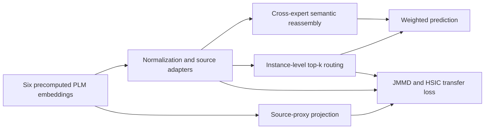

# STAIR Minimal

Instance-adaptive fusion and transfer learning with frozen protein language model (PLM) embeddings.

This project provides a minimal implementation of STAIR for training and evaluation. It maps precomputed embeddings from six PLMs into a shared task space, combines predictions through cross-expert semantic reassembly and instance-level routing, and regularizes representation adaptation with a JMMD–HSIC objective. It supports five protein property regression tasks and one subcellular localization classification task.

Associated paper: **STAIR: Selective Protein Language Model Embedding Fusion via Adaptive Routing**, by Lian Shen, Muyuan Yu, and Xiangrong Liu. The title follows the first page of the supplied manuscript.

**Before running: prepare precomputed embeddings from all six PLMs. This package includes datasets, configurations, and downstream model code, but does not include embeddings, PLM weights, embedding extraction scripts, or trained STAIR checkpoints.**

## Method Overview

The usefulness of a PLM varies across tasks and proteins. STAIR learns source contributions for each protein instead of selecting one fixed embedding combination for an entire task.

1. **Source-specific adaptation:** apply BatchNorm to the concatenated embeddings, split them by source, and map each source into a shared hidden space using a `Linear → LayerNorm → ReLU` adapter.
2. **Cross-expert semantic reassembly:** apply all prediction heads to each adapted source feature and combine their predictions according to cosine similarity between the source feature and the heads' hidden representations. During the first `floor(epochs / 10)` training epochs, each source uses only its own prediction head. Validation and inference always use full reassembly.
3. **Instance-adaptive routing:** construct a global query from all adapted features, compare it with each source key, and obtain softmax routing weights. Retain the top-k sources, renormalize their weights, and aggregate their predictions. Training uses a straight-through estimator for routing gradients.
4. **Representation transfer:** construct a source-proxy view with a factorized projector. Label-weighted JMMD aligns this view with adapted features, while a negative HSIC term encourages statistical dependence between adapted features and labels.



The training objective is:

```text
L = L_task + l_exploit × L_exploit + l_transfer × L_transfer
L_transfer = Σ_i β̄_i × (lambda_jmmd × JMMD_i − lambda_disc × HSIC_i)
```

- `L_task`: mean squared error (MSE) for regression or cross-entropy for classification.
- `L_exploit`: auxiliary supervision of the selected sources' native predictions, averaged over selected sample–source pairs.
- `β̄_i`: in this implementation, the batch mean of a source's **dense softmax routing weights**, detached from the gradient computation.
- `lambda_jmmd`: defaults to `1.0` in the code; `lambda_disc` and the other loss coefficients are specified in the task configuration.

“Frozen” refers to the upstream PLMs, which are not updated during downstream training. The adapters, prediction heads, BatchNorm, proxy projectors, and routing matrices are trainable.

## Project Structure

```text
STAIR_minimal/
├── README.md
├── requirements.txt
├── configs/
│   ├── aav.yaml
│   ├── gb1.yaml
│   ├── gfp.yaml
│   ├── location.yaml
│   ├── meltome.yaml
│   └── stability.yaml
├── src/
│   ├── data.py           # Label parsing, six-source embeddings, and DataLoader
│   ├── model.py          # Adapters, prediction heads, reassembly, and routing
│   ├── losses.py         # Task loss, auxiliary supervision, JMMD, and HSIC
│   └── train.py          # Training, checkpoint loading, evaluation, and export
└── data/
    ├── aav/
    ├── gb1/
    ├── gfp/
    ├── location/
    ├── meltome/
    ├── stability/
    ├── cath/             # Extension data; no experiment entry point in this package
    └── ppi/              # Extension data; no experiment entry point in this package
```

Prepare `embeddings/` separately. The program creates `outputs/` when it runs.

## Supported Tasks

Sample counts below come from the label TSV files in this package. Each test split is determined by `directories.test` in the corresponding YAML configuration.

| CLI Name | Task | Type / Metric | Train | Validation | Test |
|---|---|---|---:|---:|---:|
| `aav` | AAV variant fitness prediction | Regression / Spearman ρ | 28,626 | 3,181 | 50,776 |
| `gb1` | GB1 variant fitness prediction | Regression / Spearman ρ | 2,691 | 299 | 5,743 |
| `gfp` | GFP fluorescence prediction | Regression / Spearman ρ | 21,446 | 5,362 | 27,217 |
| `location` | 10-class subcellular localization | Classification / Accuracy | 9,503 | 1,678 | 490 |
| `meltome` | Protein melting temperature prediction | Regression / Spearman ρ | 22,335 | 2,482 | 3,134 |
| `stability` | Protein stability prediction | Regression / Spearman ρ | 53,614 | 2,512 | 12,851 |

**Location uses `location/location_hard.tsv` as its default test split.** The package also includes `location_test.tsv` with 2,768 samples, which is not used by default. To switch splits before training, edit `directories.test` in `configs/location.yaml`. Inference uses the configuration saved in the checkpoint.

## Installation

Run the following commands from the project root. `requirements.txt` pins these dependencies:

```text
torch==2.2.2
numpy==1.26.4
scipy==1.15.3
PyYAML==6.0.3
```

Windows PowerShell example, calling the virtual environment's Python directly without activating it:

```powershell
python -m venv .venv
.\.venv\Scripts\python.exe -m pip install -r requirements.txt
.\.venv\Scripts\python.exe src/train.py --help
```

The commands below use this Windows virtual environment path. On Linux or macOS, replace `.\.venv\Scripts\python.exe` with `python` from the appropriate environment or `.venv/bin/python`.

The default device is CPU. To use a GPU, ensure your PyTorch installation supports CUDA and `torch.cuda.is_available()` returns true, then pass `--device cuda:0`.

## Data and Embedding Preparation

### Label Files

The training entry point reads TSV files with exactly two tab-separated columns per line, **without a header or blank lines**:

```text
protein_key<TAB>target
```

Regression labels are parsed as floating-point values. Location labels are integers from `0` to `9`. The first column is the embedding lookup key and must be preserved exactly:

- AAV, GB1, and Meltome use identifiers such as `Sequence0`.
- Location uses accessions such as `Q5I0E9`.
- GFP and Stability use the complete amino acid sequence as the key.

Each task's `*_sequences.tsv` provides a `key<TAB>sequence` mapping for preparing embeddings externally. The current entry point reads only the label TSV files specified in the configuration; it does not directly read sequence mappings or raw CSV, JSON, or FASTA files.

### Embedding Sources and Dimensions

Source order and dimensions are fixed by `SOURCES` in `src/data.py`. The concatenated embedding dimension is **5248** per protein.

| PLM Source | Embedding Directory | Vector Dimension |
|---|---|---:|
| ESM3 | `esm3` | 1536 |
| OntoProtein | `ontoprotein` | 1024 |
| ProteinCLIP | `proteinclip_t5` | 128 |
| ProtST | `protst` | 512 |
| ProTrek | `protrek` | 1024 |
| ProteinDT | `proteindt` | 1024 |

Each task requires six files with the following path structure:

```text
<embeddings-dir>/<dataset>/<source>/protein_dictionary.pt
```

For AAV:

```text
embeddings/
└── aav/
    ├── esm3/protein_dictionary.pt
    ├── ontoprotein/protein_dictionary.pt
    ├── proteinclip_t5/protein_dictionary.pt
    ├── protst/protein_dictionary.pt
    ├── protrek/protein_dictionary.pt
    └── proteindt/protein_dictionary.pt
```

Each `.pt` file stores a `dict[str, torch.Tensor]`. Keys match the first column of the label TSV, and each value is a one-dimensional protein embedding of shape `(source_dim,)`. The loader checks key coverage and dimensions, then converts the embeddings to floating-point tensors.

The following example illustrates the ESM3 file format only. Zero vectors cannot reproduce the paper's results:

```python
import torch

protein_dictionary = {"Sequence0": torch.zeros(1536, dtype=torch.float32)}
torch.save(protein_dictionary, "protein_dictionary.pt")
```

Replace the example values with real embeddings extracted from the corresponding PLM and include every required protein. Training requires embeddings for the train, validation, and test splits; inference requires embeddings for the configured test split. **All six source files are required even when `--topk 1` is used.**

This package does not specify PLM version selection, pooling, or feature extraction procedures. Reproducing the experiments requires upstream embeddings consistent with those used in the paper.

## Training

After preparing all six files under `embeddings/aav/`, run the following command from the project root:

```powershell
.\.venv\Scripts\python.exe src/train.py --mode train --dataset aav --embeddings-dir embeddings --device cpu --seed 42
```
